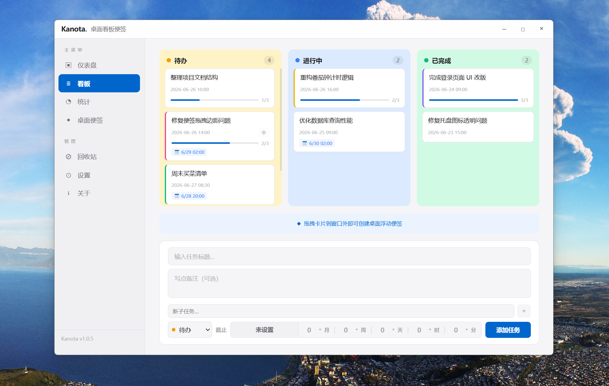
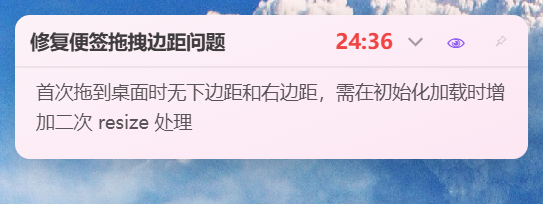
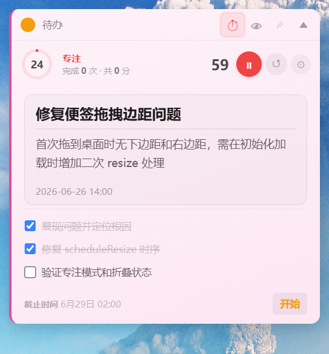

# 🗂 Kanota

**桌面看板便签** — 基于 Electron 的跨平台任务管理工具。

一边用看板拖拽管理任务进度，一边把卡片拖到桌面变成浮动便签，内置番茄钟专注计时。

| 三列看板 | 专注模式 | 番茄钟 |
|:---:|:---:|:---:|
|  |  |  |

---

## ✨ 核心功能

### 📋 三列看板
- **待办 → 进行中 → 已完成**：拖拽卡片切换状态
- 支持**拖出窗口**在桌面创建独立便签
- **双击标题**快速重命名
- **右键菜单**：打开详情、更换颜色、删除卡片
- 卡片支持 5 种颜色标签（黄/粉/蓝/绿/紫）
- **拖到回收站**删除，支持恢复
- 侧边栏显示版本信息和回收站入口

### 🪟 桌面便签
- 从看板拖出卡片自动生成浮动便签
- **折叠/展开**：点击 ▼/▲ 收缩到标题栏
- **拖拽移动**：按住标题栏拖动便签位置
- **拉伸大小**：底部、右侧、右下角拖拽缩放
- **📌 固定**：锁定便签位置，阻止意外拖动
- **状态同步**：看板中移动卡片，桌面便签实时更新状态
- **开始/完成按钮**：右下角一键切换状态
- 便签颜色、标题、内容与看板双向同步
- 支持**截止时间**设置与显示
- 支持**子任务**添加与管理

### 👁 专注模式
- 点击 👁 按钮进入**精简视图**
- 隐藏侧边栏元素，只保留标题与正文，沉浸式工作
- 顶部栏显示：状态点 + 标题 + 番茄倒计时 + 子任务折叠按钮 + 👁 + 📌
- 有子任务时**折叠按钮出现在右上角** 👁 左侧，方便快速展开查看
- 番茄打开时右侧显示红（工作中）/ 绿（休息中）倒计时
- 可在设置中开关「专注模式显示子任务」和「截止时间」

### 🍅 番茄钟
- 点击 ⏱ 按钮打开番茄计时条
- **圆环动画**：rAF 驱动平滑倒数
- 可配置**专注时长、休息时长、轮次**
- 三轮自动：专注 → 休息 → 专注 → 休息 → 专注 → 完成 ✓
- 工作时间自动累积到卡片

### 🎨 主题与界面
- **浅色 / 深色**两种主题（跟随系统偏好）
- 窗口置顶开关
- 记住关闭选择（托盘 vs 退出）
- **可设置**：显示截止时间、专注模式截止时间、便签显示创建时间、专注模式子任务

### ⚙ 数据管理
- 数据存储在可配置路径（默认 exe 同级 `data/` 文件夹）
- **设置页可自定义存储位置**
- 切换路径时可选择**迁移已有数据**
- 支持**导出/导入 JSON** 备份

---

## 🚀 快速开始

### 方式一：下载运行（推荐）

1. 打开 [Releases](https://github.com/asuka091241-ai/Kanota-Desktop-Sticky-Notes/releases) 页面
2. 下载最新的 `Kanota-vX.X.X.zip`
3. 解压，双击 `Kanota.exe` 即可运行

> 免安装，数据自动保存在解压目录的 `data/` 文件夹下。

### 方式二：从源码运行

需要 Node.js 18+

```bash
git clone https://github.com/asuka091241-ai/Kanota-Desktop-Sticky-Notes.git
cd kanban-app
npm install
npm start
```

### 方式三：自己打包

```bash
npm run build
# 输出 → release/win-unpacked/Kanota.exe
```

---

## 📖 操作指南

### 看板操作

| 操作 | 方式 |
|------|------|
| 新建卡片 | 输入框填写标题 → 回车 |
| 编辑标题 | 双击卡片标题 |
| 拖拽排序 | 拖动卡片到目标列 |
| 创建便签 | **拖出窗口**到桌面 |
| 右键菜单 | 右键卡片 → 详情/颜色/删除 |
| 回收站 | 侧边栏回收站 → 恢复/清空 |

### 桌面便签操作

| 操作 | 方式 |
|------|------|
| 移动位置 | 拖动标题栏 |
| 折叠/展开 | 点击 ▼/▲ |
| 调整大小 | 拖拽底部/右侧/右下角 |
| 固定 | 点击 📌 |
| 切换状态 | 点击右下角「开始/完成」按钮 |
| 更换颜色 | 右键 → 换色 |
| 专注模式 | 点击 👁 |
| 展开子任务 | 专注模式下点击右上角 ∨ |
| 移除 | 右键 → 从桌面移除（进入回收站） |

### 番茄钟操作

| 操作 | 方式 |
|------|------|
| 打开/关闭 | 点击 ⏱ |
| 开始/暂停 | 点击 ▶/⏸ |
| 重置 | 点击 ↺ |
| 配置时长 | 点击 ⚙ → 设置分钟和轮次 → 应用 |

---

## 🗂 项目结构

```
kanban-app/
├── main.js             # Electron 主进程（窗口、托盘、IPC、数据存储）
├── preload.js          # 看板窗口预加载（安全 IPC 桥接）
├── preload-sticky.js   # 便签窗口预加载
├── index.html          # 看板主界面（三列看板 + 侧边栏 + 设置 + 关于页）
├── sticky.html         # 桌面便签界面（折叠/拖拽/番茄钟/专注模式/子任务）
├── package.json        # 项目配置 & Electron Builder 打包配置
├── icon.*              # 应用图标
├── tray-icon.*         # 托盘图标
├── gen-tray.js         # 托盘图标生成脚本
├── build-icon.js       # 图标构建脚本
└── data/               # （运行时生成）数据文件
    ├── kanban-data.json
    ├── kanban-trash.json
    └── kanban-settings.json
```

---

## 🔧 技术栈

| 层级 | 技术 |
|------|------|
| 框架 | Electron 35 |
| 打包 | electron-builder (portable) |
| 进程通信 | IPC (contextBridge + ipcRenderer/ipcMain) |
| 动画 | CSS transition + requestAnimationFrame |
| 数据 | 本地 JSON 文件 |
| 拖拽 | 原生 HTML5 Drag & Drop API |
| 拉伸 | 主进程 polling `screen.getCursorScreenPoint()` |

---

## 👤 作者

**CaffYooO** — [github.com/asuka091241-ai/Kanota-Desktop-Sticky-Notes](https://github.com/asuka091241-ai/Kanota-Desktop-Sticky-Notes)

如有问题或建议，欢迎提交 Issue 或邮件联系：**13257035176@163.com**

---

## 📄 License

MIT
